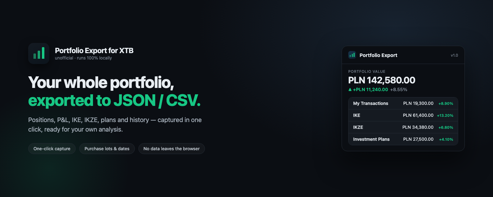
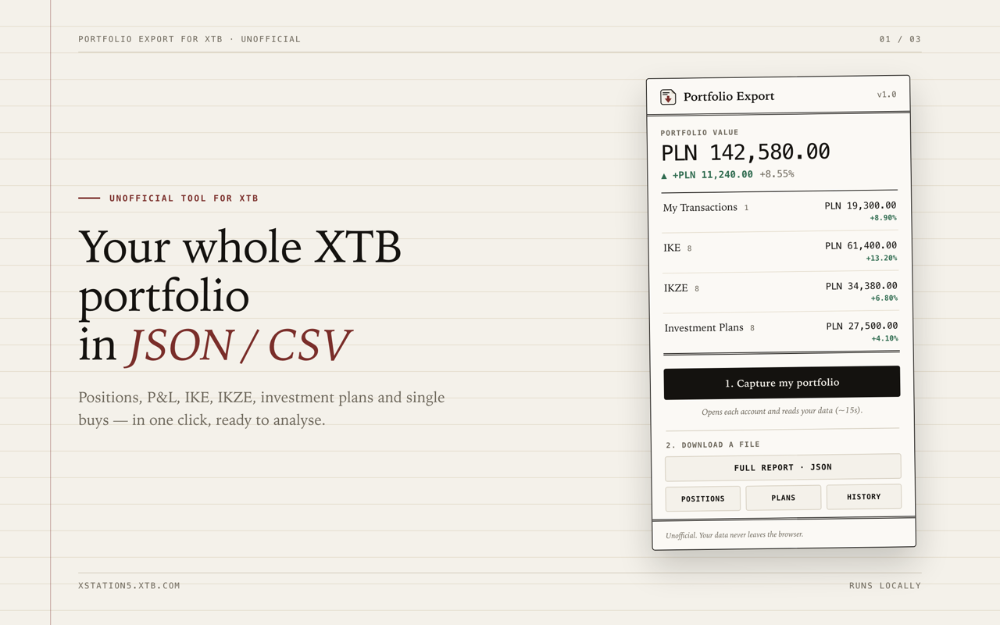
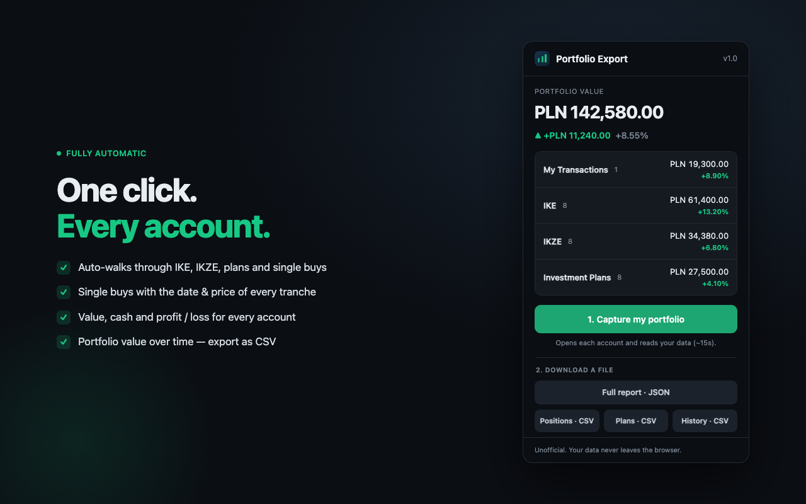
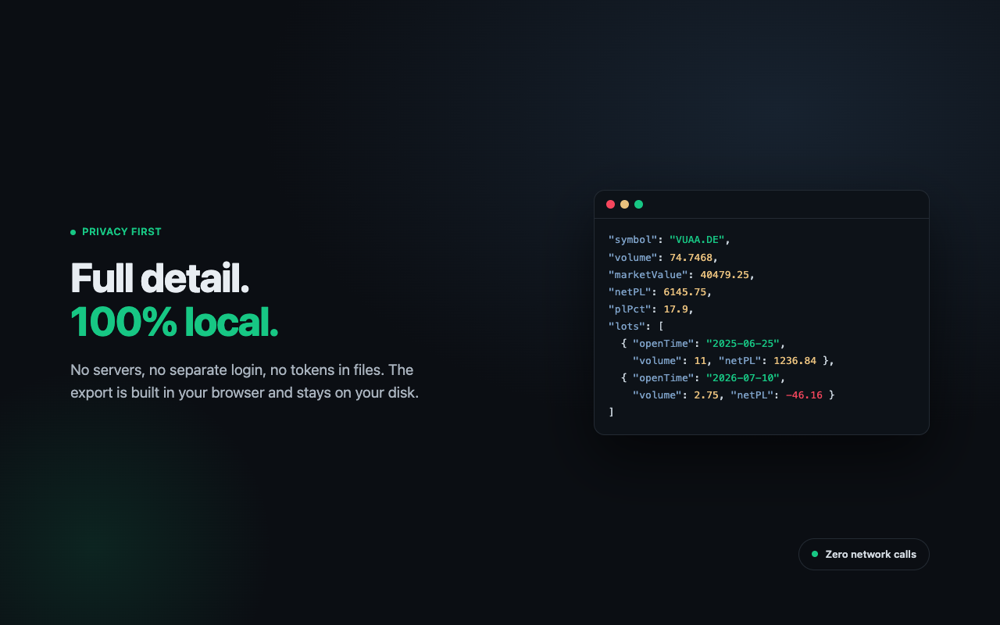

# Portfolio Export for XTB

**Unofficial.** Not affiliated with, endorsed by, or connected to XTB. The name
"XTB" only describes what the tool works with.

Save your XTB portfolio to JSON or CSV — positions, IKE, IKZE, investment plans,
and value over time. One click, no API key, no second login. It reads the data
the xStation web app already loads while you're signed in, and everything stays
in your browser.

XTB closed its public xStation5 API in March 2025, so there's no official way to
pull your own numbers anymore. This gets them back.

## Screenshots

| | |
|---|---|
|  |  |



## What it exports

- **Positions** — with P&L, average cost, and each purchase lot (its date, size and result).
- **IKE, IKZE and single-buy accounts**, kept separate.
- **Investment plans**, with each holding's allocation, value and return.
- **Balances and a portfolio summary**: holdings plus free cash, per account and overall.
- **Value over time**: one snapshot per day, saved locally, exportable as CSV.

You can download a full JSON report, or CSV files for positions, plans and
history. The interface is English and Polish, and follows your browser language.

## Install (unpacked)

1. Open `chrome://extensions` and turn on **Developer mode** (top right).
2. **Load unpacked**, and pick the `extension/` folder.
3. Open [xstation5.xtb.com](https://xstation5.xtb.com/) and sign in as usual.
4. Click the toolbar icon, then **Capture portfolio**. It walks through every
   account for you (about 15 seconds).
5. Download the format you want.

The popup is the whole interface: total value, P&L, a per-account breakdown, and
the export buttons. Nothing is added to the xStation page.

## Privacy

Everything runs in your browser. No servers, no network calls, no telemetry.
Your session token is never stored or sent anywhere; the extension reads only the
account number from it, in memory, to tell the accounts apart. Exports are plain
files you save yourself. Full policy in [PRIVACY.md](PRIVACY.md).

## How it works

The xStation web app fetches your portfolio from `ipax.xtb.com` over gRPC-Web
(binary protobuf). A content script running at `document_start` wraps `fetch`,
reads the response streams, and decodes the protobuf by structure — no
proprietary `.proto` needed. A small mapper names the fields, and the popup turns
them into JSON and CSV.

```
extension/
  src/decode.js    gRPC-Web frame parser + generic protobuf decoder
  src/inject.js    fetch hook -> decode -> forward (tagged with the account)
  src/mappers.js   field numbers -> named fields
  src/content.js   per-account store, auto-capture, popup bridge
  src/export.js    JSON / CSV builders
  popup.html/.js   the toolbar UI (the only UI)
  _locales/        English and Polish
```

The mappers check a few invariants: P&L equals value minus cost, equity equals
market value plus free cash, plan total equals the sum of the plans. If XTB
renumbers a protobuf field, the broken invariant shows a warning in the popup
instead of a silently wrong export.

### Not captured yet

Closed positions, cash operations and dividends are also on ipax gRPC
(`PortfolioClosedPositionService`, `PortfolioCashOperationService`), but the
terminal that requests them runs in a cross-origin iframe (`xcontainer.xtb.com`)
the extension doesn't inject into yet. See [BACKLOG.md](BACKLOG.md). XTB's own
terminal has a native Export for this data in the meantime.

## Build & release

`scripts/build.sh` packages the extension into `dist/`. [RELEASE.md](RELEASE.md)
has the Chrome Web Store checklist and the CI/CD workflow that publishes on a
version tag. `node test/run.js` runs the tests.

## Disclaimer

For personal use with your own account, at your own risk.
